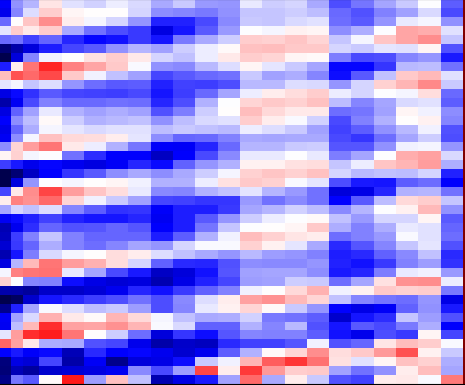

<a name="readme-top"></a>

<!-- TABLE OF CONTENTS -->
<details>
  <summary>Table of Contents</summary>
  <ol>
    <li>
      <a href="#about-the-project">About The Project</a>
    </li>
    <li>
      <a href="#getting-started">Getting Started</a>
      <ul>
        <li><a href="#prerequisites">Prerequisites</a></li>
        <li><a href="#installation">Installation</a></li>
      </ul>
    </li>
    <li><a href="#usage">Usage</a></li>
    <li><a href="#roadmap">Roadmap</a></li>
    <li><a href="#contributing">Contributing</a></li>
    <li><a href="#license">License</a></li>
    <li><a href="#contact">Contact</a></li>
    <li><a href="#acknowledgments">Acknowledgments</a></li>
    <li><a href="#howto-cite">Howto Cite</a></li>
  </ol>
</details>


<!-- PROJECT LOGO -->
<br />
<div align="center">
  <a href="https://github.com/cspurin/dmd/">
    
  </a>

  <h3 align="center">DMD for Porous Media Flows</h3>

  <p align="center">
    A Python library for interpreting core flooding experiments
    <br />
    <a href="https://github.com/cspurin/dmd/"><strong>Explore the docs »</strong></a>
    <br />
    <br />
    <a href="https://github.com/cspurin/dmd/">View Demo</a>
    ·
    <a href="https://github.com/cspurin/dmd//issues">Report Bug</a>
    ·
    <a href="https://github.com/cspurin/dmd//issues">Request Feature</a>
  </p>
</div>


<!-- ABOUT THE PROJECT -->
## About The Project

[![Product Name Screen Shot][product-screenshot]](https://github.com/cspurin/dmd/)

This project provides the source code of the figures in the publication Spurin et al. Dynamic Mode Decomposition for Analyzing Dynamics in Multi-phase Flow in Porous Media ... paper


<p align="right">(<a href="#readme-top">back to top</a>)</p>


### Built With


* Readme based on <A HREF="https://github.com/othneildrew/Best-README-Template">Best Readme Template</a>
* Jupyter notebooks generated from .py files with <A HREF="https://jupytext.readthedocs.io/en/latest/using-cli.html">jupytext</a>

<p align="right">(<a href="#readme-top">back to top</a>)</p>


<!-- GETTING STARTED -->
## Getting Started

Read the paper to get some background info. Then install your favorite Python distribution of you don't already have one (we used Anaconda),
install required libraries, download the code and run the examples.


### Prerequisites

The code and examples can be run from most modern Python distributions such as Anaconda. You may want to choose a distribution that has `matplotlib`, `numpy` and other standard packages pre-installed. There are a few extra libraries to install:

* pandas (using internally pandas data frames, but also to import/expert data)
* pydmd (the package for DMD analysi)


### Installation

1. Clone the repo
   ```sh
   git clone https://github.com/cspurin/dmd.git
   ```
2. Install additioal Python libraries<BR>
   pandas 
   ```sh
   conda install pandas
   ```
   lmfit 
   ```sh
   pip install pydmd
   ```


### Running Examples

We include 2 examples from the paper <b>Spurin et al. Dynamic Mode Decomposition for Analyzing Dynamics in Multi-phase Flow in Porous Media ... </b>

* Fig. 03-05
  ```sh
  DMD_steady-state_Darcy-scale.py
  ```
* Fig. xxx
  ```sh
  xxx.py
  ```

The `.py` files are also available as `.ipynb` Jupyter notebooks (generated with <A HREF="https://jupytext.readthedocs.io/en/latest/using-cli.html">jupytext</a>). Respective markdown tags are included in the .py files to generate the formatting e.g. headers in the Jupyter notebooks.


<p align="right">(<a href="#readme-top">back to top</a>)</p>


<!-- ROADMAP -->
## Roadmap

- [ ] Add Changelog
- [ ] Add more examples from previous papers
    - [ ] steady-state experiments
    - [ ] matching real data

<!-- 
See the [open issues](https://github.com/othneildrew/Best-README-Template/issues) for a full list of proposed features (and known issues).
-->

<p align="right">(<a href="#readme-top">back to top</a>)</p>


<!-- CONTRIBUTING -->
## Contributing

It would be great if you could contribute to this project. Any contributions you make are **greatly appreciated**.

If you have a suggestion that would make this better, please fork the repo and create a pull request. You can also simply open an issue with the tag "enhancement".
Don't forget to give the project a star! Thanks again!


<p align="right">(<a href="#readme-top">back to top</a>)</p>


<!-- LICENSE -->
## License

Distributed under the MIT License. See `LICENSE.txt` for more information.

<p align="right">(<a href="#readme-top">back to top</a>)</p>


<!-- CONTACT -->
## Contact

Catherine Spurin - <A HREF="https://www.linkedin.com/in/catherine-spurin-39404a87/?originalSubdomain=uk">LinkedIn</a> - cspurin@stanford.edu

Steffen Berg - <A HREF="https://www.linkedin.com/in/steffen-berg-5409a672">LinkedIn</a> - steffen.berg@shell.com

Project Link: [https://github.com/cspurin/dmd/](https://github.com/cspurin/dmd/)

<p align="right">(<a href="#readme-top">back to top</a>)</p>


<!-- ACKNOWLEDGMENTS -->
## Acknowledgments

We would like to acknowledge 

* James E. McClure
* Ryan T. Armstrong 

<p align="right">(<a href="#readme-top">back to top</a>)</p>


<!-- How to Cite -->
## Howto Cite

1. C. Spurin et al., Spurin et al. Dynamic Mode Decomposition for Analyzing Dynamics in Multi-phase Flow in Porous Media ... <i>to be submitted</i>


<p align="right">(<a href="#readme-top">back to top</a>)</p>


<!-- MARKDOWN LINKS & IMAGES -->
<!-- https://www.markdownguide.org/basic-syntax/#reference-style-links -->
[product-screenshot]: images/logo.png
[license-url]: https://github.com/cspurin/dmd/blob/main/license.txt
[linkedin-url]: https://www.linkedin.com/in/catherine-spurin-39404a87/?originalSubdomain=uk
[contributors-url]: https://github.com/cspurin/dmd/graphs/contributors
[forks-url]: https://github.com/cspurin/dmd/network/members
[issues-url]: https://github.com/cspurin/dmd/issues
[stars-url]: https://github.com/cspurin/dmd/stargazers
[BestReadme-url]: https://github.com/othneildrew/Best-README-Template

